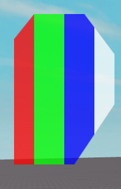

# ColoredCutFrame
The `ColoredCutFrame` class is similar to the [CutFrame](CutFrame.md),
but allows multiple colors to be used.

# BackgroundColor3 Difference
Like the `CutFrame`, the `BackgroundColor3` can be defined
as a single color, like below:
```lua
local ColoredCutFrame = require(game:GetService("ReplicatedStorage"):WaitForChild("NexusButton"):WaitForChild("Gui"):WaitForChild("ColoredCutFrame"))

--Create a ScreenGui.
local ScreenGui = Instance.new("ScreenGui")
ScreenGui.Parent = game:GetService("Players").LocalPlayer:WaitForChild("PlayerGui")

--Create an adorn frame.
local AdornFrame = Instance.new("Frame")
AdornFrame.BackgroundTransparency = 1
AdornFrame.Size = UDim2.new(0,200,0,300)
AdornFrame.Position = UDim2.new(0,50,0,50)
AdornFrame.Parent = ScreenGui

--Create a CutFrame.
local CutFrame = ColoredCutFrame.new(AdornFrame)
CutFrame.BackgroundColor3 = Color3.new(0,170/255,1)
CutFrame.BackgroundTransparency = 0.25
CutFrame.ZIndex = 4

--Cut corners.
CutFrame:CutCorner("Top","Left",UDim2.new(0.1,20,0.1,20))
CutFrame:CutCorner("Top","Right",UDim2.new(0.2,20,0.2,20),"RealtiveXY")
CutFrame:CutCorner("Bottom","Left",UDim2.new(0.3,0,0.3,0),"RealtiveXX")
CutFrame:CutCorner("Bottom","Right",UDim2.new(0.4,0,0.4,0),"RealtiveYY")

--Remove one cut.
CutFrame:RemoveCut("Bottom","Left")
```

Unlike the `CutFrame`, the `ColoredCutFrame` can use a
`ColorSequence`, with each point from 0 to 1 being where
the color starts, excluding the last keypoint.

```lua
local ColoredCutFrame = require(game:GetService("ReplicatedStorage"):WaitForChild("NexusButton"):WaitForChild("Gui"):WaitForChild("ColoredCutFrame"))

--Create a ScreenGui.
local ScreenGui = Instance.new("ScreenGui")
ScreenGui.Parent = game:GetService("Players").LocalPlayer:WaitForChild("PlayerGui")

--Create an adorn frame.
local AdornFrame = Instance.new("Frame")
AdornFrame.BackgroundTransparency = 1
AdornFrame.Size = UDim2.new(0,200,0,300)
AdornFrame.Position = UDim2.new(0,50,0,50)
AdornFrame.Parent = ScreenGui

--Create a CutFrame.
local CutFrame = ColoredCutFrame.new(AdornFrame)
CutFrame.BackgroundColor3 = ColorSequence.new({
	ColorSequenceKeypoint.new(0,Color3.new(1,0,0)),
	ColorSequenceKeypoint.new(0.2,Color3.new(0,1,0)),
	ColorSequenceKeypoint.new(0.5,Color3.new(0,0,1)),
	ColorSequenceKeypoint.new(0.8,Color3.new(1,1,1)),
	ColorSequenceKeypoint.new(1,Color3.new(0,0,0)),
})
CutFrame.BackgroundTransparency = 0.25
CutFrame.ZIndex = 4

--Cut corners.
CutFrame:CutCorner("Top","Left",UDim2.new(0.1,20,0.1,20))
CutFrame:CutCorner("Top","Right",UDim2.new(0.2,20,0.2,20),"RealtiveXY")
CutFrame:CutCorner("Bottom","Left",UDim2.new(0.3,0,0.3,0),"RealtiveXX")
CutFrame:CutCorner("Bottom","Right",UDim2.new(0.4,0,0.4,0),"RealtiveYY")

--Remove one cut.
CutFrame:RemoveCut("Bottom","Left")
```

