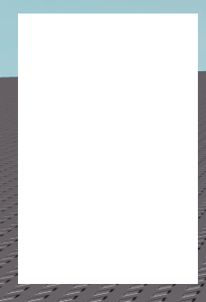
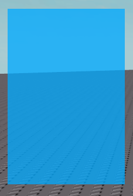
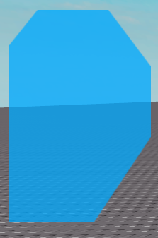
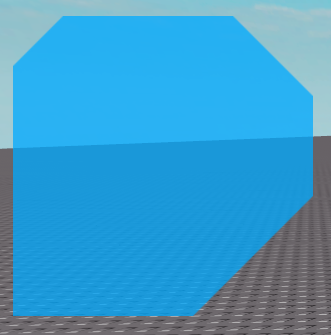

# CutFrame
The `CutFrame` class is the base class used for creating
the hexagon-shaped buttons. It can be used on its own without
a button, and can have any corners cut rather than just
the top left and bottom right.

## Creating a CutFrame
Creating a `CutFrame` requires an existing `Frame` (or any
`GuiBase`) to be adorned to. This is because it can contain
between 1 and 9 frame objects.

```lua
local CutFrame = require(game:GetService("ReplicatedStorage"):WaitForChild("NexusButton"):WaitForChild("Gui"):WaitForChild("CutFrame"))

--Create a ScreenGui.
local ScreenGui = Instance.new("ScreenGui")
ScreenGui.Parent = game:GetService("Players").LocalPlayer:WaitForChild("PlayerGui")

--Create an adorn frame.
local AdornFrame = Instance.new("Frame")
AdornFrame.BackgroundTransparency = 1
AdornFrame.Size = UDim2.new(0,200,0,300)
AdornFrame.Position = UDim2.new(0,50,0,50)
AdornFrame.Parent = ScreenGui

--Create a CutFrame.
local CutFrameInstance = CutFrame.new(AdornFrame)
```



## Properties
After being created, the following properties can be set:
- `BackgroundColor3`
- `BackgroundTransparency`
- `ZIndex`

All of them act the same as they would to a regular `Frame`.

```lua
local CutFrame = require(game:GetService("ReplicatedStorage"):WaitForChild("NexusButton"):WaitForChild("Gui"):WaitForChild("CutFrame"))

--Create a ScreenGui.
local ScreenGui = Instance.new("ScreenGui")
ScreenGui.Parent = game:GetService("Players").LocalPlayer:WaitForChild("PlayerGui")

--Create an adorn frame.
local AdornFrame = Instance.new("Frame")
AdornFrame.BackgroundTransparency = 1
AdornFrame.Size = UDim2.new(0,200,0,300)
AdornFrame.Position = UDim2.new(0,50,0,50)
AdornFrame.Parent = ScreenGui

--Create a CutFrame.
local CutFrameInstance = CutFrame.new(AdornFrame)
CutFrameInstance.BackgroundColor3 = Color3.new(0,170/255,1)
CutFrameInstance.BackgroundTransparency = 0.25
CutFrameInstance.ZIndex = 4
```



## Cutting Corners
Corners can be cut using the following method:
```lua
CutFrame:CutCorner(HorizontalSideName,VerticalSideName,CutSize,Constraint)
```

The `HorizontalSideName` and `VerticalSideName` arguments are the
corner to cut (ex: `"Top"` and `"Left"`) and trhe `CutSize` is
a `UDim2` with the size to cut with the X being the horizontal side
and the Y being the vertizal side. `Constraint` is optional and can refer
be used to set the the side's size to use for the cut. This is similar to
`SizeConstraint` for the size of a frame. To remove cuts, the `RemoveCut`
method can be used.
```lua
CutFrame:RemoveCut(HorizontalSideName,VerticalSideName)
```

Example with the methods:
```lua
local CutFrame = require(game:GetService("ReplicatedStorage"):WaitForChild("NexusButton"):WaitForChild("Gui"):WaitForChild("CutFrame"))

--Create a ScreenGui.
local ScreenGui = Instance.new("ScreenGui")
ScreenGui.Parent = game:GetService("Players").LocalPlayer:WaitForChild("PlayerGui")

--Create an adorn frame.
local AdornFrame = Instance.new("Frame")
AdornFrame.BackgroundTransparency = 1
AdornFrame.Size = UDim2.new(0,200,0,300)
AdornFrame.Position = UDim2.new(0,50,0,50)
AdornFrame.Parent = ScreenGui

--Create a CutFrame.
local CutFrameInstance = CutFrame.new(AdornFrame)
CutFrameInstance.BackgroundColor3 = Color3.new(0,170/255,1)
CutFrameInstance.BackgroundTransparency = 0.25
CutFrameInstance.ZIndex = 4

--Cut corners.
CutFrameInstance:CutCorner("Top","Left",UDim2.new(0.1,20,0.1,20))
CutFrameInstance:CutCorner("Top","Right",UDim2.new(0.2,20,0.2,20),"RealtiveXY")
CutFrameInstance:CutCorner("Bottom","Left",UDim2.new(0.3,0,0.3,0),"RealtiveXX")
CutFrameInstance:CutCorner("Bottom","Right",UDim2.new(0.4,0,0.4,0),"RealtiveYY")

--Remove one cut.
CutFrameInstance:RemoveCut("Bottom","Left")
```


If the frame is resized, the cuts will adjust to the new size.
