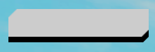
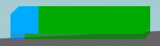
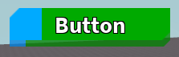
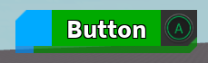

# NexusButton
The `NexusButton` class is the complete button using
`ColoredCutFrame`s and other internal classes.

## Creating NexusButton
`NexusButton` is created and set up similarly to `Frame`s.
No adorn frame is needed, and properties can be directly
set and read from with the object.
```lua
local NexusButton = require(game.ReplicatedStorage:WaitForChild("NexusButton"))

--Create a ScreenGui.
local ScreenGui = Instance.new("ScreenGui")
ScreenGui.Parent = game:GetService("Players").LocalPlayer:WaitForChild("PlayerGui")

--Create a button.
local Button = NexusButton.new()
Button.Size = UDim2.new(0,200,0,40)
Button.Position = UDim2.new(0,50,0,50)
Button.Parent = ScreenGui
```

By default, the `BorderSizePixel` is set to 0,
but a border appears because of a custom property
added called `BorderSizeScale`, which defaults to 0.2.
Both can be used concurrently like a `UDim`.



## Setting Colors
Like regular buttons, the background color can be set
to a `Color3` for both the `BackgroundColor3` and
`BorderColor3`. Additionally, the `BorderTransparency`
can be set.
```lua
local NexusButton = require(game.ReplicatedStorage:WaitForChild("NexusButton"))

--Create a ScreenGui.
local ScreenGui = Instance.new("ScreenGui")
ScreenGui.Parent = game:GetService("Players").LocalPlayer:WaitForChild("PlayerGui")

--Create a button.
local Button = NexusButton.new()
Button.Size = UDim2.new(0,200,0,40)
Button.Position = UDim2.new(0,50,0,50)
Button.BackgroundColor3 = Color3.new(0,170/255,255/255)
Button.BorderColor3 = Color3.new(0,140/255,225/255)
Button.BorderTransparency = 0.25
Button.Parent = ScreenGui
```


Both `BackgroundColor3` and `BorderColor3` accept `ColorSequence`s
as well.
```lua
local NexusButton = require(game.ReplicatedStorage:WaitForChild("NexusButton"))

--Create a ScreenGui.
local ScreenGui = Instance.new("ScreenGui")
ScreenGui.Parent = game:GetService("Players").LocalPlayer:WaitForChild("PlayerGui")

--Create a button.
local Button = NexusButton.new()
Button.Size = UDim2.new(0,200,0,40)
Button.Position = UDim2.new(0,50,0,50)
Button.BackgroundColor3 = ColorSequence.new({
    ColorSequenceKeypoint.new(0,Color3.new(0,170/255,255/255)),
    ColorSequenceKeypoint.new(0.2,Color3.new(0,170/255,0)),
    ColorSequenceKeypoint.new(1,Color3.new(0,170/255,0)),
})
Button.BorderColor3 = ColorSequence.new({
    ColorSequenceKeypoint.new(0,Color3.new(0,130/255,225/255)),
    ColorSequenceKeypoint.new(0.1,Color3.new(0,130/255,0)),
    ColorSequenceKeypoint.new(1,Color3.new(0,130/255,0)),
})
Button.BorderTransparency = 0.25
Button.Parent = ScreenGui
```



## Adding Children
Adding children isn't as straight forward since the class
is a table. This means direct parenting will result in an error.
A frame that can be used to parent items can be obtained using
`NexusButton:GetAdornFrame()`.
```lua
local NexusButton = require(game.ReplicatedStorage:WaitForChild("NexusButton"))

--Create a ScreenGui.
local ScreenGui = Instance.new("ScreenGui")
ScreenGui.Parent = game:GetService("Players").LocalPlayer:WaitForChild("PlayerGui")

--Create a button.
local Button = NexusButton.new()
Button.Size = UDim2.new(0,200,0,40)
Button.Position = UDim2.new(0,50,0,50)
Button.BackgroundColor3 = ColorSequence.new({
    ColorSequenceKeypoint.new(0,Color3.new(0,170/255,255/255)),
    ColorSequenceKeypoint.new(0.2,Color3.new(0,170/255,0)),
    ColorSequenceKeypoint.new(1,Color3.new(0,170/255,0)),
})
Button.BorderColor3 = ColorSequence.new({
    ColorSequenceKeypoint.new(0,Color3.new(0,130/255,225/255)),
    ColorSequenceKeypoint.new(0.1,Color3.new(0,130/255,0)),
    ColorSequenceKeypoint.new(1,Color3.new(0,130/255,0)),
})
Button.BorderTransparency = 0.25
Button.Parent = ScreenGui

--Add a text label.
local TextLabel = Instance.new("TextLabel")
TextLabel.Size = UDim2.new(1,0,0.9,0)
TextLabel.AnchorPoint = Vector2.new(0.5,0.5)
TextLabel.Position = UDim2.new(0.5,0,0.5,0)
TextLabel.BackgroundTransparency = 1
TextLabel.Font = Enum.Font.SourceSansBold
TextLabel.TextColor3 = Color3.new(1,1,1)
TextLabel.TextStrokeColor3 = Color3.new(0,0,0)
TextLabel.TextStrokeTransparency = 0
TextLabel.TextScaled = true
TextLabel.Text = "Button"
TextLabel.Parent = Button:GetAdornFrame()
```



## Controller Icons
Controller icons can be added to the button using
`NexusButton:SetControllerIcon(KeyCode)`. To make
the mouse events get triggered by the controller icon,
`NexusButton:MapKey(KeyCode,MouseInput)`. Note that
controller icons only show when a controller is detected.
```lua
local NexusButton = require(game.ReplicatedStorage:WaitForChild("NexusButton"))

--Create a ScreenGui.
local ScreenGui = Instance.new("ScreenGui")
ScreenGui.Parent = game:GetService("Players").LocalPlayer:WaitForChild("PlayerGui")

--Create a button.
local Button = NexusButton.new()
Button.Size = UDim2.new(0,200,0,40)
Button.Position = UDim2.new(0,50,0,50)
Button.BackgroundColor3 = ColorSequence.new({
    ColorSequenceKeypoint.new(0,Color3.new(0,170/255,255/255)),
    ColorSequenceKeypoint.new(0.2,Color3.new(0,170/255,0)),
    ColorSequenceKeypoint.new(1,Color3.new(0,170/255,0)),
})
Button.BorderColor3 = ColorSequence.new({
    ColorSequenceKeypoint.new(0,Color3.new(0,130/255,225/255)),
    ColorSequenceKeypoint.new(0.1,Color3.new(0,130/255,0)),
    ColorSequenceKeypoint.new(1,Color3.new(0,130/255,0)),
})
Button.BorderTransparency = 0.25
Button.Parent = ScreenGui

--Set up the controller button.
Button:SetControllerIcon("ButtonA")
Button:MapKey("ButtonA","MouseButton1")

--Add a text label.
local TextLabel = Instance.new("TextLabel")
TextLabel.Size = UDim2.new(1,0,0.9,0)
TextLabel.AnchorPoint = Vector2.new(0.5,0.5)
TextLabel.Position = UDim2.new(0.5,0,0.5,0)
TextLabel.BackgroundTransparency = 1
TextLabel.Font = Enum.Font.SourceSansBold
TextLabel.TextColor3 = Color3.new(1,1,1)
TextLabel.TextStrokeColor3 = Color3.new(0,0,0)
TextLabel.TextStrokeTransparency = 0
TextLabel.TextScaled = true
TextLabel.Text = "Button"
TextLabel.Parent = Button:GetAdornFrame()

--Connect the events.
Button.MouseButton1Down:Connect(function()
    print("Mouse button 1 down.")
end)

Button.MouseButton1Up:Connect(function()
    print("Mouse button 1 up.")
end)
```

